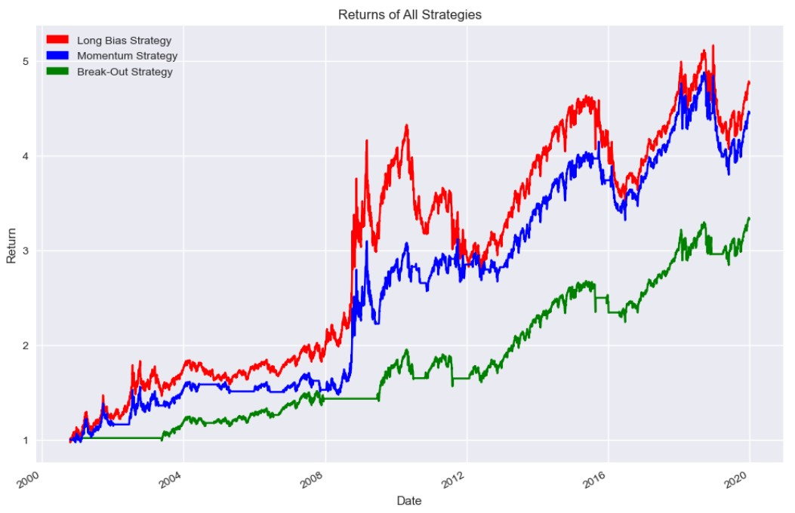

# Sentiment Based Algorithmic Trading

This project selects a stocks from the S&P500 index and filters them by public sentiment towards them. Following this, 3 different trading strategies are tested against these stocks: breakout, long bias and momentum strategies. To visualise the returns, there is a function which can plot out line curves for each strategy. 

The strategy which provides the highest return along with the strategy which has the lowest risk are both returned to the user.


## API Used: Alpha Vantage 

#### Get sentiment

```python
import requests

# replace the "demo" apikey below with your own key from https://www.alphavantage.co/support/#api-key
url = 'https://www.alphavantage.co/query?function=NEWS_SENTIMENT&tickers=AAPL&apikey=demo'
r = requests.get(url)
data = r.json()

print(data)
```

#### For more Alpha Vantage API actions, click link below.

```html
  https://www.alphavantage.co/documentation/
```


## Authors

- [@RaymondShao](https://github.com/rsha0)


## Features

- Average stock sentiment function using Alpha Vantage API
- Sorting stocks by sentiment function
- Breakout Strategy Algorithm
- Long Bias Strategy Algorithm
- Momentum Strategy Algorithm
- Plots returns for each strategy
- Obtains strategy with the highest returns along with strategy that has the lowest risk


## 🛠 Skills
Python, Pandas, Matplotlib, Yfinance, Alpha Vantage API, Data Analysis


## Returns of Different Strategies Example



